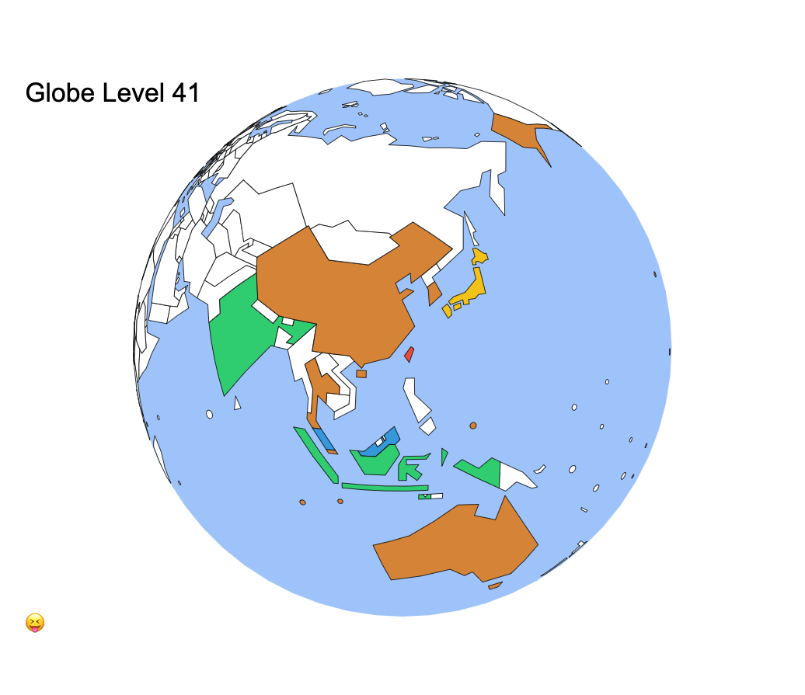

# GlobeLevel

A simple map to showcase your world traveling footprint

## Concept

Based on the [JapanEx](https://zhung.com.tw/japanex) and [TaiwanEx](https://zhung.com.tw/taiwanex) project, I decided to make a global version. However, everything goes much more complicated than I think as diving into this project.

1. The area I need to cover for whole world is much larger than that for a single country, and I do NOT want to use the existing _realistic_ world map shape.
2. I want to render the map in 3D globe view, rather than 2D which used for the previous two projects, so the convertion between 2D svg and coordinates GeoJSON becomes an issue.
3. How many regions I need to draw is kind of geopolitics. There are 47 and 24 counties for Japan and Taiwan respectively, this is an official truth. But, how many countries there are in the world is not and can be disputed.

Anyway, I started drawing a world map like before, figuring out how to arrange those 199 regions all in proper positions, without lose too much their original boundary shapes.

### Regions Rule

The 199 regions chosen in the world is based on the following rules:

- 193: [Member states of the United Nations](https://www.un.org/en/about-us/member-states)
- 3: The regions and the main land are separated by other sovereign states.
    - Greenland (Denmark)
    - New Caledonia (France)
    - Guyane (France)
- 3: Chosen for personal reason.
    - Antarctica
    - Taiwan
    - Vantican City

## Data Sources

1. [World Atlas TopoJSON](https://github.com/topojson/world-atlas)
2. [World countries](https://github.com/stefangabos/world_countries)
3. [Chinese country names](https://gist.github.com/jacobbubu/060d84c2bdf005d412db)
4. [International Date Line Longitude, Latitude Coordinates](https://ithoughthecamewithyou.com/post/international-date-line-longitude-latitude-coordinates)

## References

1. [D3 API Reference](https://github.com/d3/d3/blob/master/API.md)
2. [D3 Quadtree](https://github.com/d3/d3-quadtree)
3. [Rotate the World - Jason Davies](https://www.jasondavies.com/maps/rotate/)
4. [Orthographic Zoom III](https://bl.ocks.org/curran/0bb64d8f56042e2480c908b0985f063b)
5. [Collision Detection](https://bl.ocks.org/mbostock/3231298)
6. [Circles on an Axis in a Static Force Layout](http://bl.ocks.org/ericandrewlewis/dc79d22c74b8046a5512)
7. [Visited: Map where I've been](https://apps.apple.com/us/app/visited-map-where-ive-been/id846983349)

## Useful Tools

1. [CSV to GeoJSON](http://www.convertcsv.com/csv-to-geojson.htm)
2. [GeoJSON Editor](http://geojson.io)
3. [Mapshaper](https://mapshaper.org)

